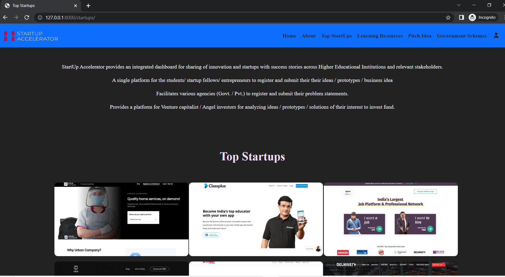
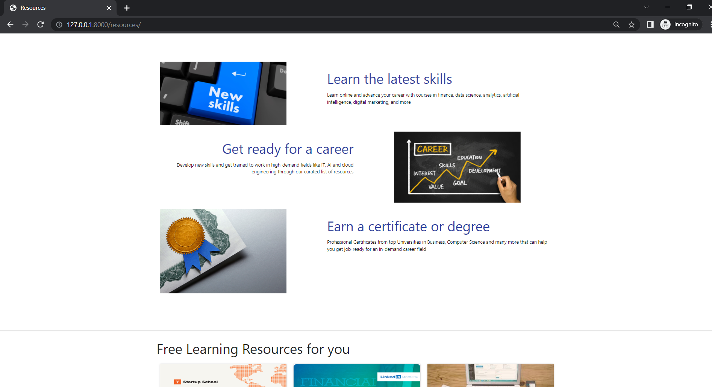
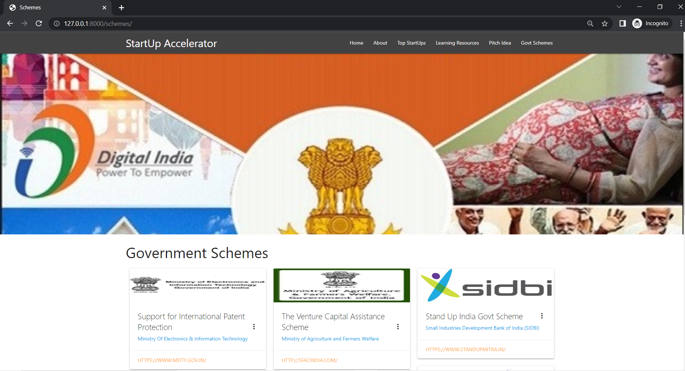
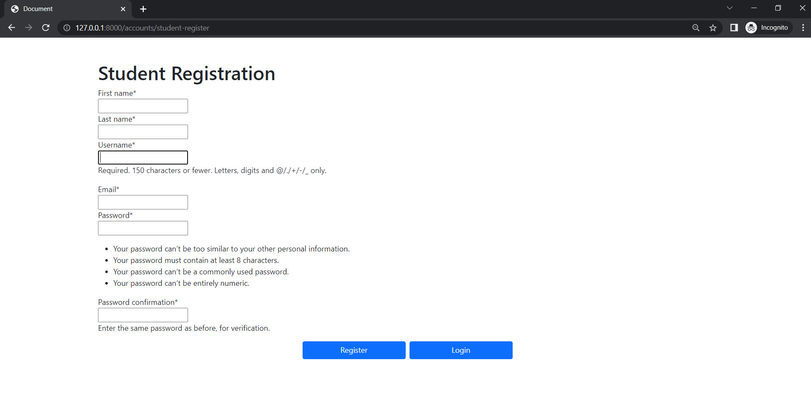
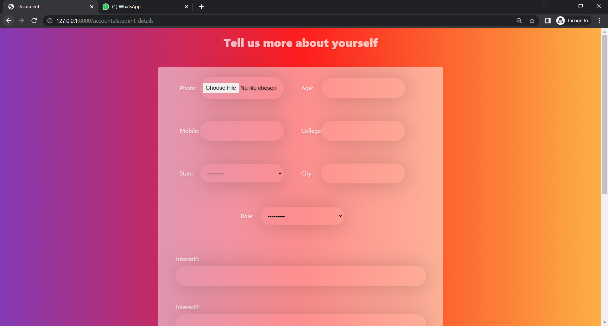
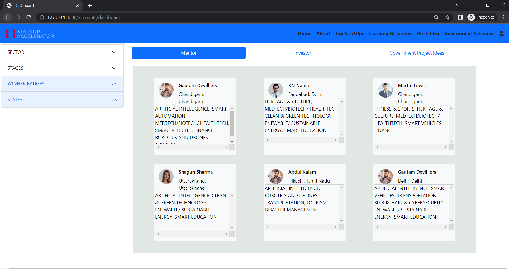
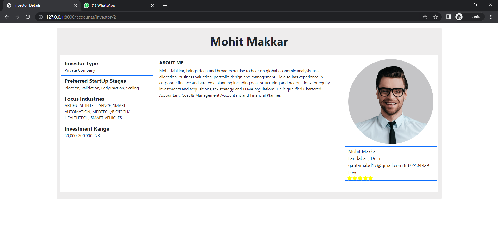
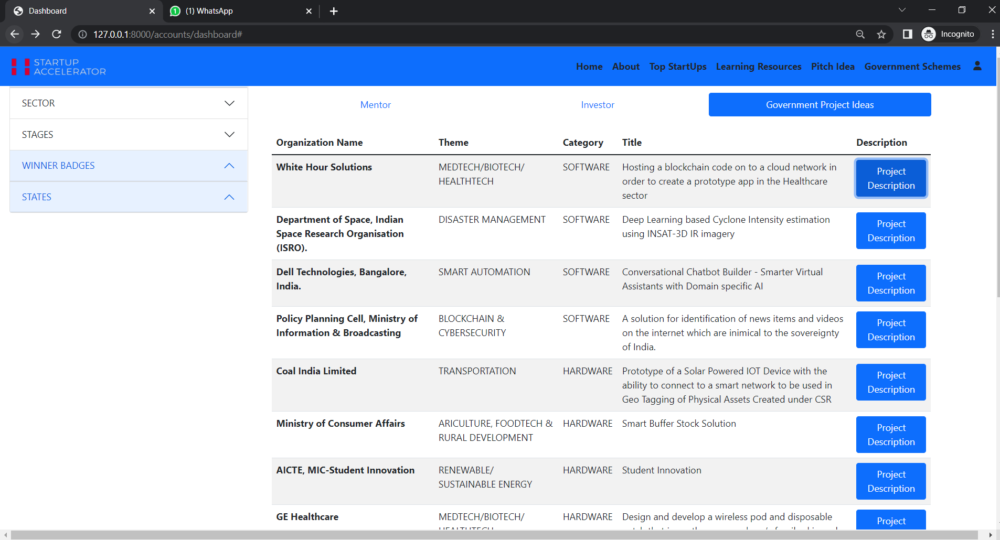
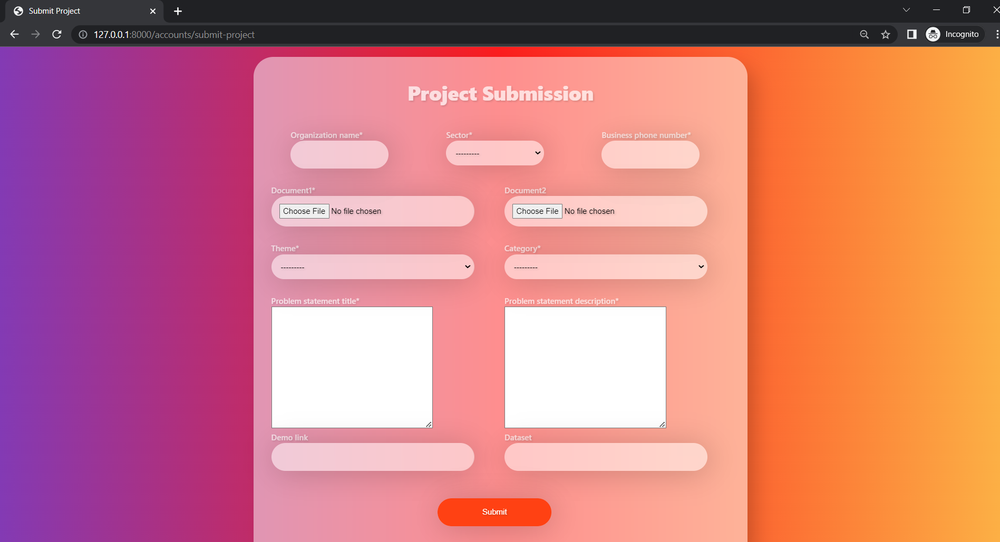

## Idea Title	
StartUp-Accelerator : AI powered web portal for Startups

## Problem Statement Title
Development of Integrated dashboard for sharing of innovation and startups with success stories across Higher Educational Institutions and relevant stakeholders

## Problem Statement Description
"Innovation and entrepreneurship is a part of Make in India campaign of Govt of India. There are several innovations happening across HEIs in India, which can be referred and could be taken further for implementation with appropriate permissions. Accordingly, a portal shall give facility to all HEIs and their students to share details on innovation and start-ups with copy right issues addressed as appropriate.The main focus of this problem statement is to 

1. To develop a single platform for the students / startup fellows / entrepreneurs to register and submit their their ideas / prototypes / business idea 

2. To facilitate various agencies (Govt. / Pvt.) to register and submit their problem statements 

3. To provide a platform for Venture capitalist / Angel investors for analyzing ideas / prototypes / solutions of their interest to invest fund 

4. To create a bucket of mentor in different disciplines It aims to create a common platform for the aspirant students / start up fellows / entrepreneurs for pitching their ideas / prototype / solutions against their own innovation / raised by various agencies."

 

## Presentation Link
[Idea Link](https://drive.google.com/file/d/1_Ox-p-TFOkk89-yWpEuqvqbiZrea46Br/view?usp=sharing)

## Idea Abstract
Due to lack of mentorship and inadequate investments, the budding entrepreneurs of India are unable to emerge to the foreground. To tackle this challenge our team is developing a comprehensive AI powered interactive and integrated web platform for such brilliant minds to submit or exchange their ideas, prototypes or business models. It will be a great opportunity for students, startup fellows, fundraisers, mentors, venture capitalists and various different organizations to connect and grow together. With this platform students and entrepreneurs can pitch their ideas or prototypes, get funding and connect with mentors or investors. Investors can choose any startup of their interest and make strategical investment in those start-ups. Mentors will assist start-ups and aspiring entrepreneurs in turning their ideas into reality, as well as in understanding the market that they intend to target with their product. The application enables quality interaction of startup fellows with mentors so that they can pitch their ideas via mail, video call or AI based chatbot. Also, we have included a quantitative Machine Learning model that enables an objective and fact-based approach for startup success prediction and analysis. Our AI powered web-portal is capable of generating concise insights about the entrepreneur and his/her solution to the investors/mentors. Furthermore, the Interactive dashboards will be included to display startup trends in different parts of India. This portal will also provide free tools to help individuals understand the various stages of a start-ups and markets. We will use block-chain to create a secure database with zero control over data, which will also aid with authenticating.

## Solution Description
The government of India's “Make in India” initiative includes innovation and entrepreneurship. There are various innovations taking place across Higher Education Institutions (HEIs) in India that may be referenced to and taken further for implementation with required clearances. As a result, our team is developing a portal to enable all HEIs and their students to exchange information on innovation and start-ups, with copy rights as needed. The primary goal is to catalyse the culture of start-ups, innovation, technology and entrepreneurship in India through our AI driven interactive and integrated platform that allows students, startup fellows, and entrepreneurs to register and submit their ideas, prototypes, and business plans. The application makes it easier for diverse government and private sector organisations to register and submit their problem statements. We aim to provide a forum for venture capitalists and angel investors to analyse ideas, prototypes, and solutions in which they are interested in investing funds. Also it enables to assemble a pool of mentors from different fields which can provide valuable guidance to start-up fellows and students. In return, they will be getting royalties. Our machine learning model enables an objective and fact-based approach for startup success prediction and analysis. Our AI powered web-portal is capable of generating concise insights about the entrepreneur and his/her solution to the investors/mentors, making use of tone and emotion analysis. Furthermore, the Interactive dashboards will be included to display startup trends in different parts of India. The application is an initiative towards “Make in India” campaign to facilitate investments, foster innovations and boost Indian economy.

 

## Website Snapshots

### Front Page

### Top Start Ups

### Resources

### Government Schemes

### Student/StartUp Fellow Registration

### Further Details

### Mentor/Investor Info

### Organization Projects

### Project Submission

